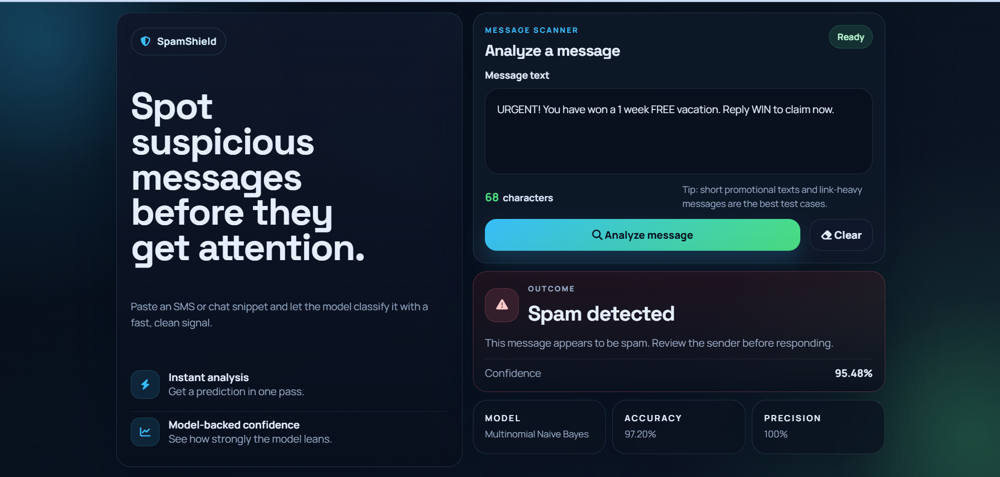

# SpamShield

SpamShield is a lightweight Flask web app that detects spam messages using a trained scikit-learn model. Paste an SMS or chat snippet into the UI to get a quick prediction and confidence score.

**Features**
- Fast, browser-based message analysis
- Preprocessing pipeline in `src/preprocess.py`
- Model and vectorizer loaded from `models/`

**Requirements**
- Python 3.8+
- See `requirements.txt` for Python dependencies

**Quickstart**
1. Create and activate a virtual environment:

   Windows PowerShell
   ```powershell
   python -m venv venv
   .\venv\Scripts\Activate.ps1
   ```

   macOS / Linux
   ```bash
   python3 -m venv venv
   source venv/bin/activate
   ```

2. Install dependencies:

```bash
pip install -r requirements.txt
```

3. Start the app:

```bash
python app.py
```

4. Open your browser at `http://127.0.0.1:5000` and paste a message to analyze.

**Project Structure**
- [app.py](app.py) — Flask application entrypoint
- [requirements.txt](requirements.txt) — Python dependencies
- [src/preprocess.py](src/preprocess.py) — text preprocessing utilities
- [src/train.py](src/train.py) — training script (if available)
- [templates/index.html](templates/index.html) — front-end template
- [static/](static/) — CSS, JS, favicon
- [models/](models/) — serialized model artifacts 
- [data/spam.csv](data/spam.csv) — example dataset 
- [models/](models/) — serialized model artifacts
   - `models/model.pkl` — trained scikit-learn classifier (pickle format). The app loads this on startup.
   - `models/vectorizer.pkl` — fitted text vectorizer (e.g., `CountVectorizer` or `TfidfVectorizer`) used to transform incoming text before prediction.

If you retrain the model, overwrite these two files in the `models/` folder. A simple training script is available at `src/train.py` which demonstrates fitting a vectorizer and a classifier, then saving artifacts with `joblib`.

Example (train + save):
```bash
python src/train.py
```

**Screenshot**
Below is a preview of the app UI. Save your screenshot to `static/screenshot.png` to display it here:




**Contributing**
Contributions are welcome. Please open issues or pull requests with clear descriptions and tests when relevant.